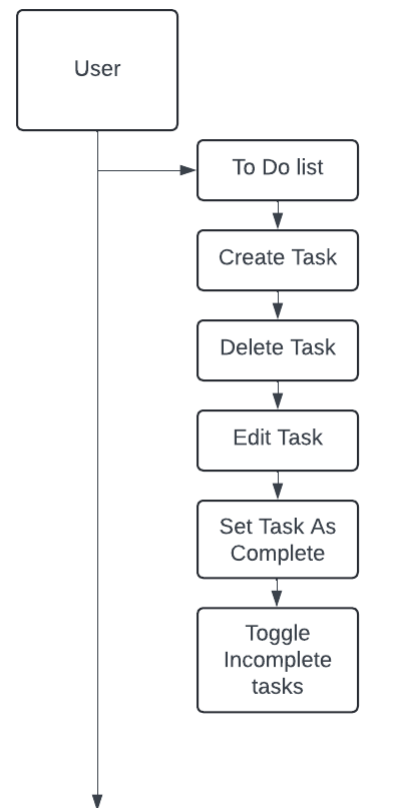
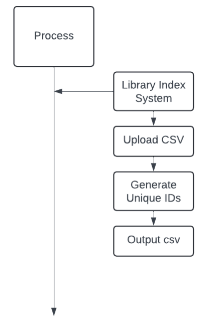
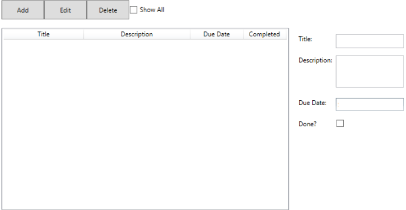

### To Do List
#### Planning Phase

By 11/05/2024
* Produce a definition statement for each problem in the portfolio.

By 18/05/2024
* Create a data dictionary outlining data structures, control structures, and data storage requirements.

By 25/05/2024
* Develop algorithm designs using pseudo code, flowcharts, or diagrams as needed.

By 01/06/2024
* Design aesthetic graphical user interfaces (GUI) for relevant problems.

#### Development Phase

By 01/06/2024
* Develop solutions to the problems.

By 02/06/2024
* Develop test plans to ensure the solutions work as expected.

By 04/06/2024
* Test the solutions.

#### Evaluation Phase

By 05/06/2024
* Review designs with others to identify areas for refinement.

By 06/06/2024
* Make decisions based on feedback and refine designs accordingly.

By 07/06/2024
* Evaluate the final products.


### Tasked with 2 problems

#### Problem one:

The first problem involves creating a to-do list that supports the addition and removal of tasks, as well as the ability to track their completion status. The tasks should have a title, description, and due date, with the description and due date being modifiable. Additionally, the completion status of tasks should be changeable. The application should display a list of tasks and provide an option to toggle between viewing all tasks or only those that are incomplete. Despite the complexity of the problem, it can be effectively addressed using Windows Presentation Foundation (WPF).

**Requirements:** 
* Description and due date should be mutable.
* Displaying a list of tasks.
* Toggling whether all tasks or only incomplete tasks are displayed.
* Code should be readable.
* Code should be robust.
* Creation and deletion of tasks.
* tracking done state and allowing tasks to be set to complete.
* Supporting title, description, due date.

#### Problem two:

The second problem involves developing a library indexing system. This system should automatically read book details such as title, author, publisher, and publication date from a stored CSV file, generate a unique index reference, and then write this information to a new CSV file. This problem is less complex than the first one, and the use of external libraries simplifies the task. The solution should include a separate class responsible for assigning serial numbers, implemented through an interface to allow for alternative implementations in the future.

**Requirements:**
* An interface to allow alternative implementations later.
* Code should be readable.
* Code should be robust.
* Read book details (title, author, publisher, publication date) from a stored CSV file.
* Generate unique index reference.
* Write the new details to a new CSV file.

### Case diagrams

#### Problem one:



#### Problem two:



### Data Dictionary

#### Problem one:

**Namespaces and libraries**

```
using System;
using System.Collections.ObjectModel;
using System.ComponentModel;
using System.Linq;
using System.Runtime.CompilerServices;
using System.Windows;
using System.Windows.Controls;
```

These namespaces offer crucial classes and methods necessary for the development and management of the to-do list application. They include functionalities for data collections, notifying property changes, executing LINQ queries, and handling UI controls.

**Data structures**

```
public ObservableCollection<TodoListItem> TodoItems { get; set; }
public ObservableCollection<TodoListItem> DisplayedItems { get; set; }
```

**Control structures**

```
private void AddButton_Click(object sender, RoutedEventArgs e)
{
 if (masterList.SelectedItem != null)
 {
 var selectedItem = (TodoListItem)masterList.SelectedItem;
 selectedItem.Description = descriptionField.Text;
 selectedItem.DueDate = dueDatePicker.SelectedDate ?? DateTime.Now;
 selectedItem.IsDone = isDoneCheckbox.IsChecked == true;
 }
 else
 {
 var newItem = new TodoListItem
 {
 Title = titleField.Text,
 Description = descriptionField.Text,
 DueDate = dueDatePicker.SelectedDate ?? DateTime.Now,
 IsDone = isDoneCheckbox.IsChecked == true
 };
 TodoItems.Add(newItem);
 }
 UpdateDisplayedItems();
 ClearDetailFields();
}
private void EditButton_Click(object sender, RoutedEventArgs e) { ... }
private void DeleteButton_Click(object sender, RoutedEventArgs e) { ... }
private void MasterList_SelectionChanged(object sender, SelectionChangedEventArgs
e) { ... }
private void ShowAllCheckBox_Checked(object sender, RoutedEventArgs e) { ... }
```

Event handlers manage user interactions, such as deleting, adding, editing, selecting to-do items, and toggling the display of completed items.

**Data storage**

```
public ObservableCollection<TodoListItem> TodoItems { get; set; }
public ObservableCollection<TodoListItem> DisplayedItems { get; set; }
```

### Problem two: Data dictionary

**Namespaces and libraries**

```
using CsvHelper;
using CsvHelper.Configuration;
using System;
using System.Collections.Generic;
using System.Globalization;
using System.IO;
using System.Security.Cryptography;
using System.Text;
```

These provide the ability to use external libraries so that I could easily read and write CSV files, and give them a unique ID

**Data structures:**

```
var records = csv.GetRecords<Book>().ToList();
```

Book objects are stored

**Control structures:**

```
foreach (var record in records)
{
 record.Code = codeAssigner.GenerateHashCode(record);
 csvw.WriteField(record.Code);
 csvw.WriteField(record.Name);
 csvw.WriteField(record.Title);
 csvw.WriteField(record.Place);
 csvw.WriteField(record.Publisher);
 csvw.WriteField(record.Date);
 csvw.NextRecord();
 validRecordsCount++;
}
```

This code iterates over each record and gives it a code then writes it to the CSV file.

**Data Storage:**

Data was stored in CSV files. The Input was U16A2Task2Data.csv Output was BookArray.csv.

### Algorithm design

#### Problem one

```
BEGIN PROGRAM
 DEFINE CLASS MainWindow INHERITS Window
 DEFINE PUBLIC PROPERTY TodoItems AS ObservableCollection<TodoListItem>
 DEFINE PUBLIC PROPERTY DisplayedItems AS
ObservableCollection<TodoListItem>

 DEFINE CONSTRUCTOR FUNCTION MainWindow
 CALL InitializeComponent METHOD
 INITIALIZE TodoItems AS NEW ObservableCollection<TodoListItem>
 INITIALIZE DisplayedItems AS NEW ObservableCollection<TodoListItem>
WITH TodoItems
 SET ItemsSource PROPERTY OF masterList TO DisplayedItems
 END CONSTRUCTOR

 DEFINE FUNCTION AddButton_Click WITH sender AND e AS PARAMETERS
 IF masterList HAS SELECTED ITEM THEN
 GET SELECTED ITEM FROM masterList AND ASSIGN TO selectedItem
 SET Description PROPERTY OF selectedItem TO TEXT IN
descriptionField
 SET DueDate PROPERTY OF selectedItem TO SELECTED DATE IN
dueDatePicker OR CURRENT DATE IF NONE SELECTED
 SET IsDone PROPERTY OF selectedItem BASED ON WHETHER
isDoneCheckbox IS CHECKED
 ELSE
 CREATE NEW TodoListItem WITH TITLE FROM titleField
 SET Description PROPERTY OF NEW ITEM TO TEXT IN descriptionField
 SET DueDate PROPERTY OF NEW ITEM TO SELECTED DATE IN dueDatePicker
OR CURRENT DATE IF NONE SELECTED
 SET IsDone PROPERTY OF NEW ITEM BASED ON WHETHER isDoneCheckbox IS
CHECKED
 ADD NEW ITEM TO TodoItems
 CALL UpdateDisplayedItems FUNCTION
 CALL ClearDetailFields FUNCTION
 END FUNCTION

 DEFINE FUNCTION EditButton_Click WITH sender AND e AS PARAMETERS
 IF masterList HAS SELECTED ITEM THEN
 GET SELECTED ITEM FROM masterList AND ASSIGN TO selectedItem
 SET TEXT IN titleField TO Title PROPERTY OF selectedItem
 SET TEXT IN descriptionField TO Description PROPERTY OF
selectedItem
 SET SELECTED DATE IN dueDatePicker TO DueDate PROPERTY OF
selectedItem
 SET CHECKED STATE OF isDoneCheckbox BASED ON IsDone PROPERTY OF
selectedItem
 SET IsReadOnly PROPERTY OF descriptionField TO FALSE
 END FUNCTION
 DEFINE FUNCTION DeleteButton_Click WITH sender AND e AS PARAMETERS
 IF masterList HAS SELECTED ITEM THEN
 REMOVE SELECTED ITEM FROM TodoItems
 CALL UpdateDisplayedItems FUNCTION
 END FUNCTION
 DEFINE FUNCTION MasterList_SelectionChanged WITH sender AND e AS
PARAMETERS
 IF masterList HAS SELECTED ITEM THEN
 GET SELECTED ITEM FROM masterList AND ASSIGN TO selectedItem
 SET TEXT IN titleField TO Title PROPERTY OF selectedItem
 SET TEXT IN descriptionField TO Description PROPERTY OF
selectedItem
 SET SELECTED DATE IN dueDatePicker TO DueDate PROPERTY OF
selectedItem
 SET CHECKED STATE OF isDoneCheckbox BASED ON IsDone PROPERTY OF
selectedItem
 SET IsReadOnly PROPERTY OF descriptionField TO TRUE
 END FUNCTION
 DEFINE FUNCTION ShowAllCheckBox_Checked WITH sender AND e AS PARAMETERS
 CALL UpdateDisplayedItems FUNCTION
 END FUNCTION
 DEFINE FUNCTION UpdateDisplayedItems
 CLEAR DisplayedItems
 IF showAllCheckBox IS CHECKED THEN
 ADD ALL ITEMS FROM TodoItems TO DisplayedItems
 ELSE
 ADD ITEMS FROM TodoItems TO DisplayedItems WHERE IsDone IS FALSE
 END FUNCTION
 DEFINE FUNCTION ClearDetailFields
 CLEAR TEXT IN titleField
 CLEAR TEXT IN descriptionField
 CLEAR SELECTED DATE IN dueDatePicker
 UNCHECK isDoneCheckbox
 SET IsReadOnly PROPERTY OF descriptionField TO FALSE
 SET SELECTED ITEM OF masterList TO NULL
 END FUNCTION
 END CLASS
 DEFINE CLASS TodoListItem IMPLEMENTS INotifyPropertyChanged
 DEFINE PRIVATE FIELDS description, dueDate, and isDone

 DEFINE CONSTRUCTOR FUNCTION TodoListItem WITH title AS PARAMETER
 SET Title PROPERTY TO title
 END CONSTRUCTOR
 DEFINE PROPERTY Title
 GETTER ONLY

 DEFINE PROPERTY Description
 GETTER AND SETTER
 IF VALUE CHANGES THEN INVOKE PropertyChanged EVENT FOR THIS
PROPERTY

 DEFINE PROPERTY DueDate
 GETTER AND SETTER
 IF VALUE CHANGES THEN INVOKE PropertyChanged EVENT FOR THIS
PROPERTY

 DEFINE PROPERTY IsDone
 GETTER AND SETTER
 IF VALUE CHANGES THEN INVOKE PropertyChanged EVENT FOR THIS
PROPERTY

 DEFINE EVENT PropertyChanged OF TYPE PropertyChangedEventHandler

 DEFINE FUNCTION OnPropertyChanged WITH name AS PARAMETER (DEFAULTED TO
NULL)
 IF PropertyChanged IS NOT NULL THEN INVOKE IT WITH THIS OBJECT AND
PropertyChangedEventArgs WITH name AS ARGUMENT
 END CLASS
END PROGRAM
```

#### Problem two

```
BEGIN PROGRAM
 DEFINE CLASS Program
 FUNCTION Main(args)
 SET filePath TO "U16A2Task2Data.csv"
 SET newFilePath TO "BooksCodes.csv"
 OPEN filePath FOR READING AS reader
 INITIALIZE CsvReader with reader and CsvConfiguration
 REGISTER BookMap WITH CsvReader
 SET records TO READ ALL RECORDS FROM CsvReader AS List OF Book OBJECTS
 SET validRecordsCount TO 0
 INITIALIZE codeAssigner AS NEW MD5CodeAssigner
 OPEN newFilePath FOR WRITING AS writer
 INITIALIZE CsvWriter WITH writer AND CultureInfo.InvariantCulture
 FOR EACH record IN records
 SET record.Code TO codeAssigner.GenerateHashCode(record)
 WRITE record.Code TO CsvWriter
 WRITE record.Name TO CsvWriter
 WRITE record.Title TO CsvWriter
 WRITE record.Place TO CsvWriter
 WRITE record.Publisher TO CsvWriter
 WRITE record.Date TO CsvWriter
 MOVE TO NEXT RECORD IN CsvWriter
 INCREMENT validRecordsCount BY 1
 END FOR
 PRINT "{records.Count} lines of input read, {validRecordsCount} valid
records created."
 WAIT FOR USER INPUT
 END FUNCTION
 END CLASS
 DEFINE INTERFACE ICodeAssigner
 FUNCTION GenerateHashCode(book AS Book) RETURNS STRING
 END INTERFACE
 DEFINE CLASS MD5CodeAssigner IMPLEMENTS ICodeAssigner
 FUNCTION GenerateHashCode(book AS Book) RETURNS STRING
 CONCATENATE book.Name, book.Title, book.Place, book.Publisher,
book.Date INTO bookString
 INITIALIZE md5 AS MD5 INSTANCE
 CONVERT bookString TO ASCII BYTES AS inputBytes
 COMPUTE md5 HASH OF inputBytes AS hashBytes
 INITIALIZE sb AS NEW StringBuilder
 FOR EACH byte IN hashBytes
 APPEND byte IN HEX FORMAT TO sb
 END FOR
 SET truncatedHash TO "AX" + LAST 6 CHARACTERS OF sb
 RETURN truncatedHash
 END FUNCTION
 END CLASS
 DEFINE CLASS Book
 PROPERTY Name AS STRING
 PROPERTY Title AS STRING
 PROPERTY Place AS STRING
 PROPERTY Publisher AS STRING
 PROPERTY Date AS STRING
 PROPERTY Code AS STRING
 END CLASS
 DEFINE SEALED CLASS BookMap INHERITS ClassMap<Book>
 FUNCTION BookMap
 MAP Name TO INDEX 0
 MAP Title TO INDEX 1
 MAP Place TO INDEX 2
 MAP Publisher TO INDEX 3
 MAP Date TO INDEX 4
 END FUNCTION
 END CLASS
END PROGRAM
```

### GUI Design



Using photoshop i created a rough design of how i wanted it to look like

### Design decisions

#### Problem one

For this issue, I've chosen to use a WPF application for its implementation. My decision is based on WPF's capability to create visually attractive user interfaces packed with rich features and animations. Its data binding capabilities simplify the process of connecting UI elements to data, thereby improving the application's usability and maintainability. Additionally, the use of XAML ensures a clean separation between UI design and logic. This separation allows for easier collaboration between designers and developers, making it easier to maintain and update the application in the future.

#### Problem two

For this issue, I've opted to use a console application and incorporate the external library CSVHelper. This library significantly simplifies the process of reading from and writing to CSV files. While I could have utilized the built-in file I/O capabilities of .NET, I found that CSVHelper streamlines the process more effectively. 