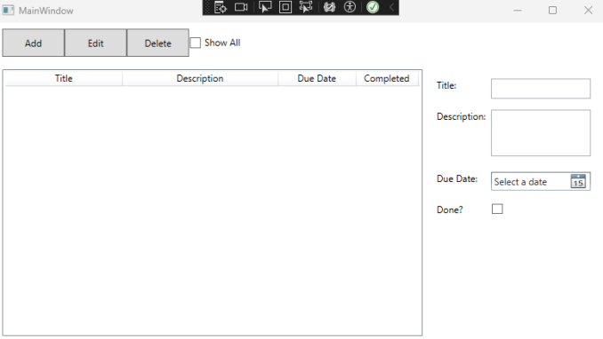
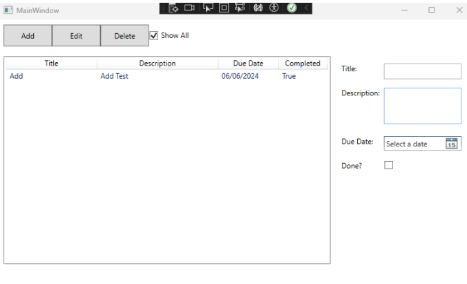
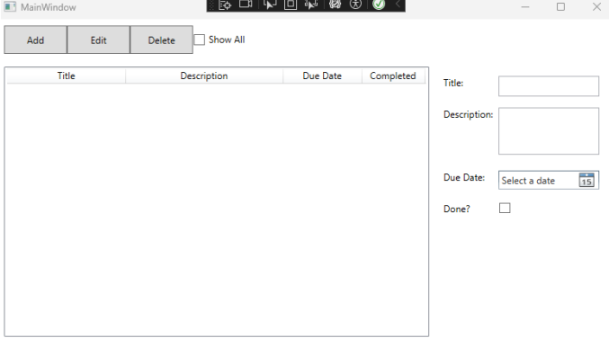
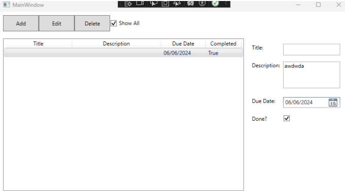
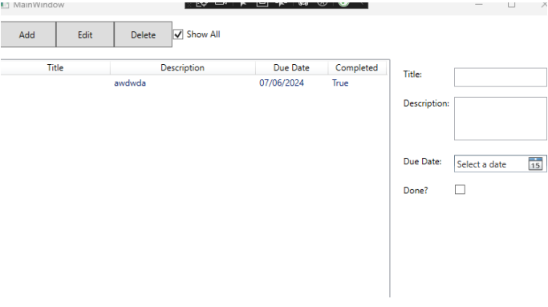
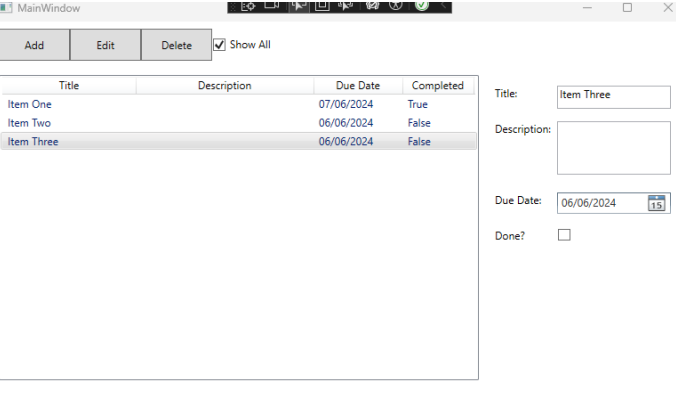
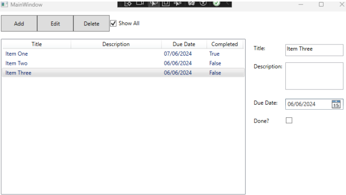
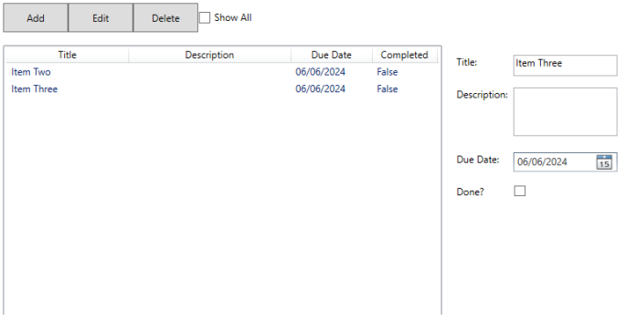
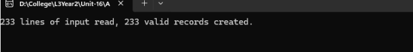
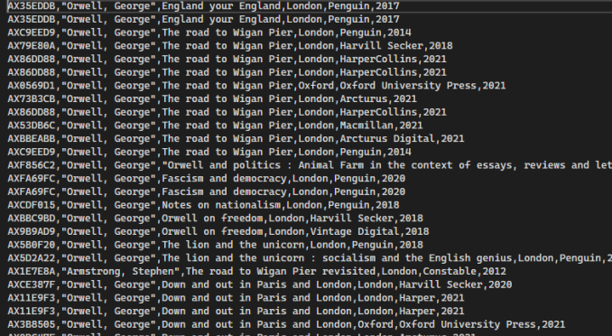

# Problem

To solve the problem i created a to-do list using WPF application (Windows Presentation Foundation) and C# programming language.

``` 
<Window x:Class="Unit_16_A2_To_Do_List.MainWindow"
 xmlns="http://schemas.microsoft.com/winfx/2006/xaml/presentation"
 xmlns:x="http://schemas.microsoft.com/winfx/2006/xaml"
 xmlns:d="http://schemas.microsoft.com/expression/blend/2008"
 xmlns:mc="http://schemas.openxmlformats.org/markup-compatibility/2006"
 xmlns:local="clr-namespace:Unit_16_A2_To_Do_List"
 mc:Ignorable="d"
 Title="MainWindow" Height="450" Width="800">
 <DockPanel LastChildFill="True">
 <Grid DockPanel.Dock="Top" Margin="8">
 <Grid.ColumnDefinitions>
 <ColumnDefinition Width="80" />
 <ColumnDefinition Width="Auto" />
 <ColumnDefinition Width="Auto" />
 <ColumnDefinition Width="Auto" />
 </Grid.ColumnDefinitions>
 <Button x:Name="addButton" Content="Add" Grid.Column="0" Width="80"
Height="36" Click="AddButton_Click"/>
 <Button x:Name="editButton" Content="Edit" Grid.Column="1" Width="80"
Height="36" Click="EditButton_Click"/>
 <Button x:Name="deleteButton" Content="Delete" Grid.Column="2"
Width="80" Height="36" Click="DeleteButton_Click"/>
 <CheckBox x:Name="showAllCheckBox" Content="Show All" Grid.Column="3"
VerticalAlignment="Center" HorizontalAlignment="Center"
Checked="ShowAllCheckBox_Checked" Unchecked="ShowAllCheckBox_Checked"/>
 </Grid>
 <ListView x:Name="masterList" Margin="8"
SelectionChanged="MasterList_SelectionChanged">
 <ListView.View>
 <GridView>
 <GridViewColumn Header="Title" DisplayMemberBinding="{Binding
Title}" Width="150"/>
 <GridViewColumn Header="Description" DisplayMemberBinding="
{Binding Description}" Width="200"/>
 <GridViewColumn Header="Due Date" DisplayMemberBinding="
{Binding DueDate, StringFormat={}{0:dd/MM/yyyy}}" Width="100"/>
 <GridViewColumn Header="Completed" DisplayMemberBinding="
{Binding IsDone}" Width="80"/>
 </GridView>
 </ListView.View>
 </ListView>
 <Grid x:Name="detailView" Margin="10">
 <TextBlock Text="Title:" Margin="0,10,0,0" VerticalAlignment="Top"/>
 <TextBox x:Name="titleField" Margin="70,10,10,0" Height="26"
VerticalAlignment="Top"/>
 <TextBlock Text="Description:" Margin="0,50,0,0"
VerticalAlignment="Top"/>
 <TextBox x:Name="descriptionField" Margin="70,50,10,0" Height="60"
VerticalAlignment="Top"/>
 <TextBlock Text="Due Date:" Margin="0,130,0,0"
VerticalAlignment="Top"/>
 <DatePicker x:Name="dueDatePicker" Margin="70,130,10,0"
VerticalAlignment="Top"/>
 <TextBlock Text="Done?" Margin="0,170,0,0" VerticalAlignment="Top"/>
 <CheckBox x:Name="isDoneCheckbox" Margin="70,170,0,0"
VerticalAlignment="Top"/>
 </Grid>
 </DockPanel>
</Window>
```

```
using System;
using System.Collections.ObjectModel;
using System.ComponentModel;
using System.Linq;
using System.Runtime.CompilerServices;
using System.Windows;
using System.Windows.Controls;
namespace Unit_16_A2_To_Do_List
{
 public partial class MainWindow : Window
 {
 public ObservableCollection<TodoListItem> TodoItems { get; set; }
 public ObservableCollection<TodoListItem> DisplayedItems { get; set; }
 public MainWindow()
 {
 InitializeComponent();
 TodoItems = new ObservableCollection<TodoListItem>();
 DisplayedItems = new ObservableCollection<TodoListItem>(TodoItems);
 masterList.ItemsSource = DisplayedItems;
 }
 private void AddButton_Click(object sender, RoutedEventArgs e)
 {
 if (masterList.SelectedItem != null)
 {
 var selectedItem = (TodoListItem)masterList.SelectedItem;
 selectedItem.Description = descriptionField.Text;
 selectedItem.DueDate = dueDatePicker.SelectedDate ?? DateTime.Now;
 selectedItem.IsDone = isDoneCheckbox.IsChecked == true;
 }
 else
 {
 var newItem = new TodoListItem(titleField.Text)
 {
 Description = descriptionField.Text,
 DueDate = dueDatePicker.SelectedDate ?? DateTime.Now,
 IsDone = isDoneCheckbox.IsChecked == true
 };
 TodoItems.Add(newItem);
 }
 UpdateDisplayedItems();
 ClearDetailFields();
 }
 private void EditButton_Click(object sender, RoutedEventArgs e)
 {
 if (masterList.SelectedItem != null)
 {
 var selectedItem = (TodoListItem)masterList.SelectedItem;
 titleField.Text = selectedItem.Title;
 descriptionField.Text = selectedItem.Description;
 dueDatePicker.SelectedDate = selectedItem.DueDate;
 isDoneCheckbox.IsChecked = selectedItem.IsDone;
 descriptionField.IsReadOnly = false;
 }
 }
 private void DeleteButton_Click(object sender, RoutedEventArgs e)
 {
 if (masterList.SelectedItem != null)
 {
 TodoItems.Remove((TodoListItem)masterList.SelectedItem);
 UpdateDisplayedItems();
 }
 }
 private void MasterList_SelectionChanged(object sender,
SelectionChangedEventArgs e)
 {
 if (masterList.SelectedItem != null)
 {
 var selectedItem = (TodoListItem)masterList.SelectedItem;
 titleField.Text = selectedItem.Title;
 descriptionField.Text = selectedItem.Description;
 dueDatePicker.SelectedDate = selectedItem.DueDate;
 isDoneCheckbox.IsChecked = selectedItem.IsDone;
 descriptionField.IsReadOnly = true;
 }
 }
 private void ShowAllCheckBox_Checked(object sender, RoutedEventArgs e)
 {
 UpdateDisplayedItems();
 }
 private void UpdateDisplayedItems()
 {
 DisplayedItems.Clear();
 var itemsToShow = showAllCheckBox.IsChecked == true
 ? TodoItems
 : TodoItems.Where(item => !item.IsDone);
 foreach (var item in itemsToShow)
 {
 DisplayedItems.Add(item);
 }
 }
 private void ClearDetailFields()
 {
 titleField.Clear();
 descriptionField.Clear();
 dueDatePicker.SelectedDate = null;
 isDoneCheckbox.IsChecked = false;
 descriptionField.IsReadOnly = false;
 masterList.SelectedItem = null;
 }
 }
 public class TodoListItem : INotifyPropertyChanged
 {
 private string description;
 private DateTime dueDate;
 private bool isDone;
 public TodoListItem(string title)
 {
 Title = title;
 }
 public string Title { get; }
 public string Description
 {
 get => description;
 set
 {
 description = value;
 OnPropertyChanged();
 }
 }
 public DateTime DueDate
 {
 get => dueDate;
 set
 {
 dueDate = value;
 OnPropertyChanged();
 }
 }
 public bool IsDone
 {
 get => isDone;
 set
 {
 isDone = value;
 OnPropertyChanged();
 }
 }
 public event PropertyChangedEventHandler PropertyChanged;
 protected void OnPropertyChanged([CallerMemberName] string name = null)
 {
 PropertyChanged?.Invoke(this, new PropertyChangedEventArgs(name));
 }
 }
}
```

# Problem 2

To solve this problem i created a library management system using a console appliction

```
using CsvHelper;
using CsvHelper.Configuration;
using System;
using System.Collections.Generic;
using System.Globalization;
using System.IO;
using System.Security.Cryptography;
using System.Text;
namespace U16A2Library
{
 class Program
 {
 static void Main(string[] args)
 {
 string filePath = "U16A2Task2Data.csv";
 string newFilePath = "BooksCode.csv";
 using (var reader = new StreamReader(filePath))
 using (var csv = new CsvReader(reader, new
CsvConfiguration(CultureInfo.InvariantCulture)))
 {
 csv.Context.RegisterClassMap<BookMap>();
 var records = csv.GetRecords<Book>().ToList();
 int validRecordsCount = 0;
 ICodeAssigner codeAssigner = new MD5CodeAssigner();
 using (var writer = new StreamWriter(newFilePath))
 using (var csvw = new CsvWriter(writer,
CultureInfo.InvariantCulture))
 {
 foreach (var record in records)
 {
 record.Code = codeAssigner.GenerateHashCode(record);
 csvw.WriteField(record.Code);
 csvw.WriteField(record.Name);
 csvw.WriteField(record.Title);
 csvw.WriteField(record.Place);
 csvw.WriteField(record.Publisher);
 csvw.WriteField(record.Date);

 csvw.NextRecord();
 validRecordsCount++;
 }
 }
 Console.WriteLine($"{records.Count} lines of input read,
{validRecordsCount} valid records created.");
 }
 Console.ReadLine();
 }
 public interface ICodeAssigner
 {
 string GenerateHashCode(Book book);
 }
 public class MD5CodeAssigner : ICodeAssigner
 {
 public string GenerateHashCode(Book book)
 {
 string bookString = $"{book.Name}-{book.Title}-{book.Place}-
{book.Publisher}-{book.Date}";
 using (MD5 md5 = MD5.Create())
 {
 byte[] inputBytes = Encoding.ASCII.GetBytes(bookString);
 byte[] hashBytes = md5.ComputeHash(inputBytes);
 StringBuilder sb = new StringBuilder();
 for (int i = 0; i < hashBytes.Length; i++)
 {
 sb.Append(hashBytes[i].ToString("X2"));
 }
 string truncatedHash = "AX" +
sb.ToString().Substring(sb.Length - 6);
 return truncatedHash;
 }
 }
 }
 public class Book
 {
 public string Name { get; set; }
 public string Title { get; set; }
 public string Place { get; set; }
 public string Publisher { get; set; }
 public string Date { get; set; }
 public string Code { get; set; }
 }
 public sealed class BookMap : ClassMap<Book>
 {
 public BookMap()
 {
 Map(m => m.Name).Index(0);
 Map(m => m.Title).Index(1);
 Map(m => m.Place).Index(2);
 Map(m => m.Publisher).Index(3);
 Map(m => m.Date).Index(4);
 }
 }
 }
}
```

# Test plans

### First problem

#### **Test plan**


| Test case | Description                                                       | Expected Result                                                          | Actual Result                                           |
|-----------|-------------------------------------------------------------------|--------------------------------------------------------------------------|---------------------------------------------------------|
| 1         | Creation and deletion of tasks                                    | That the solution will allow for the creation and deletion of tasks      | Can add and delete tasks                                |
| 2         | Tracking done state and allowing tasks to be set to complete      | A tick box saying if the task is completed                               | There is a completed tic box                            |
| 3         | Supporting title, description, due date, completed status         | That it has those components                                             | Has all the necessary components                        |
| 4         | Description and Due Date are mutable                              | The description and due date can be changed                              | They can be changed                                     |
| 5         | Displaying a list of tasks                                        | That the tasks are displayed                                             | The tasks are displayed                                 |
| 6         | Toggling whether all tasks or only incomplete tasks are displayed | The Incomplete tasks can be displayed separately                         | You can toggle incomplete tasks or all tasks            |

#### **The components**



Add then delete,





Description and due date are changeable





Displayed in a list



Incomplete task toggle.




### Second problem

#### **Test plan**

| Test Case | Description                                   | Test Data              | Expected Result                                      | Pass/Fail |
|-----------|-----------------------------------------------|------------------------|------------------------------------------------------|-----------|
| 1         | Test that it reads the input file correctly   | U16A2Task2Data.csv     | It will read it correctly                            | Pass      |
| 2         | Test that it correctly generates a code       | U16A2Task2Data.csv     | It will correctly generate a code                    | Pass      |
| 3         | That it generates the output correctly        | U16A2Task2Data.csv     | It will correctly output the BooksCode.csv           | Pass      |


#### Output result: correct




#### Code generated without errors



### Reviews and optimizations

**Luke Mauger**


**Mitchell Aldrich**


#### Feedback response

I agree with the feedback given and have added comments in the code for easier readability which happened to be the mutual suggestion.

# Evaluation

I am confident that my final product successfully meets the requirements. Throughout the different stages of development, I made numerous decisions to ensure my solutions meet the requirements. 

During the design phase, I decided to add comments to my code for better readability, which was a common suggestion from my peers. This decision not only improved the readability of my code but also made it easier for other developers to understand the logic behind my solutions. 

In the development phase, I took the feedback received into consideration and made necessary changes. I improved the structure of my code and added exception handling to make my code more robust. This decision has made my code more resilient to errors and provides useful insight into any potential issues. 

Overall, my decisions during all phases have allowed me to create robust and readable solutions. While alternative solutions were considered, I believe the decisions I made were the best fit for the requirements of this project. I am confident that my code successfully meets all the requirements.